# SSM基于Java的小型图书馆借阅管理系统的设计和实现-展示案例

#### 介绍
SSM基于Java的小型图书馆借阅管理系统的设计和实现-展示案例

#### 软件架构
开发语言：Java
框架：ssm
JDK版本：JDK1.8
服务器：tomcat7
数据库：mysql 5.7
开发软件：eclipse/myeclipse/idea
Maven包：Maven3.3.9

#### 安装教程

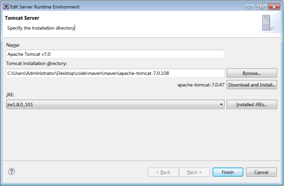
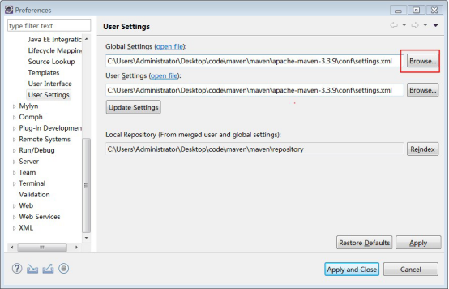
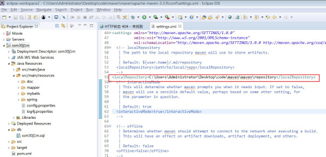
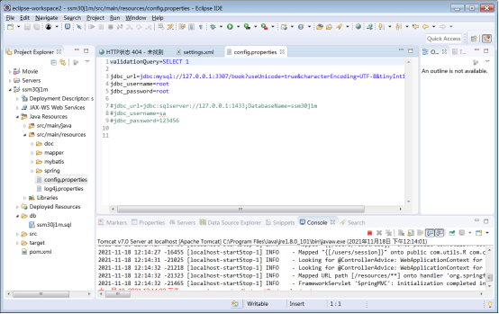

#### 展示图片

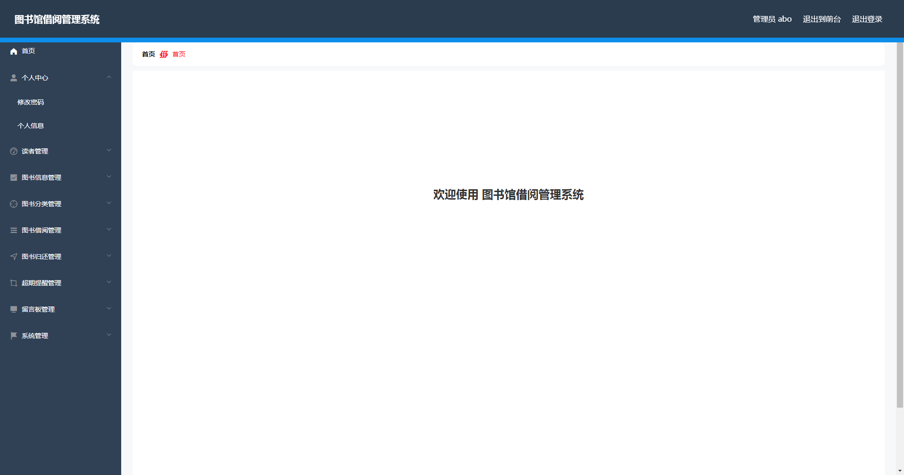
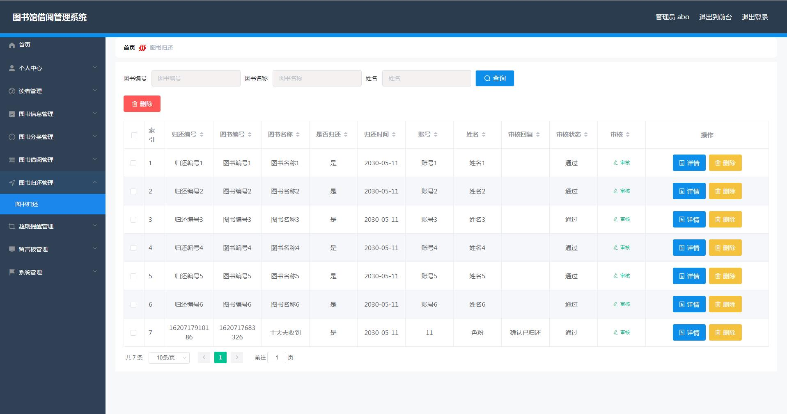
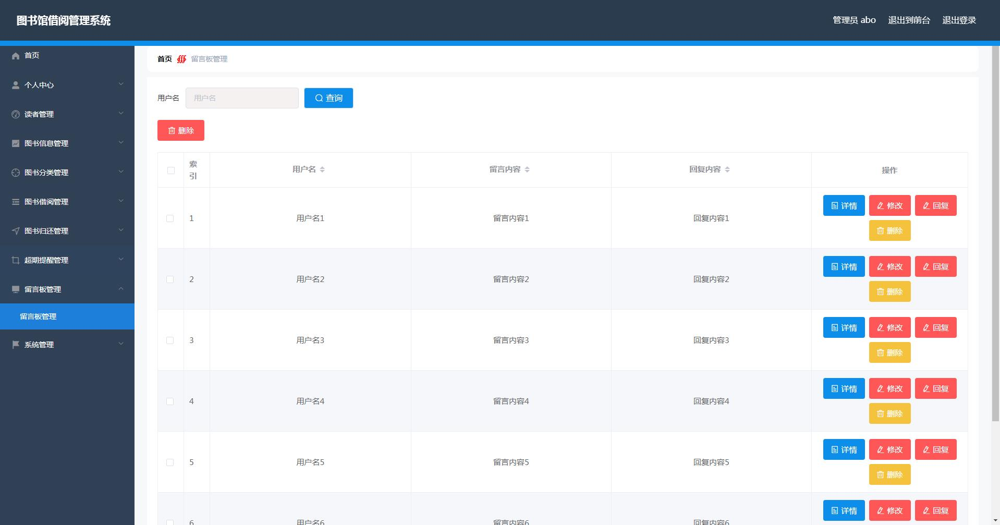

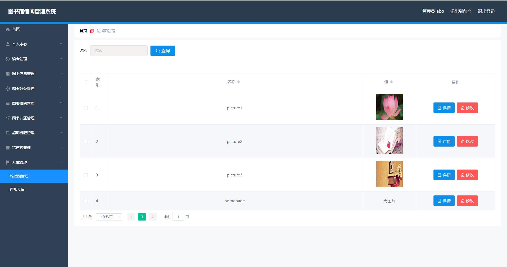
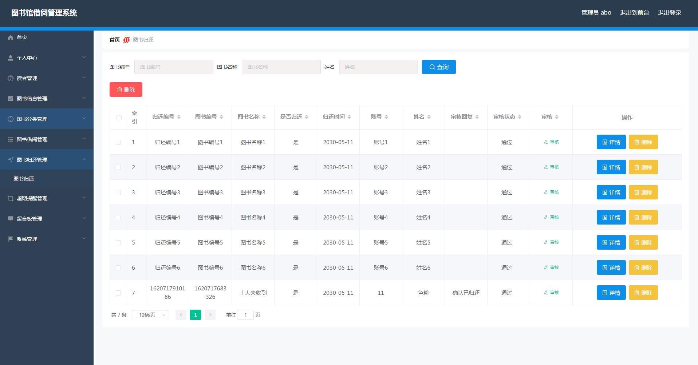
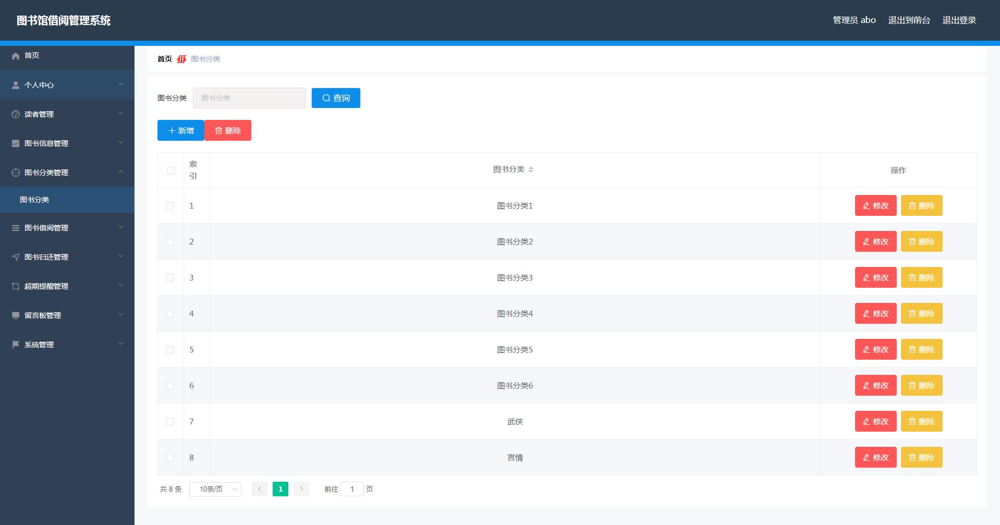
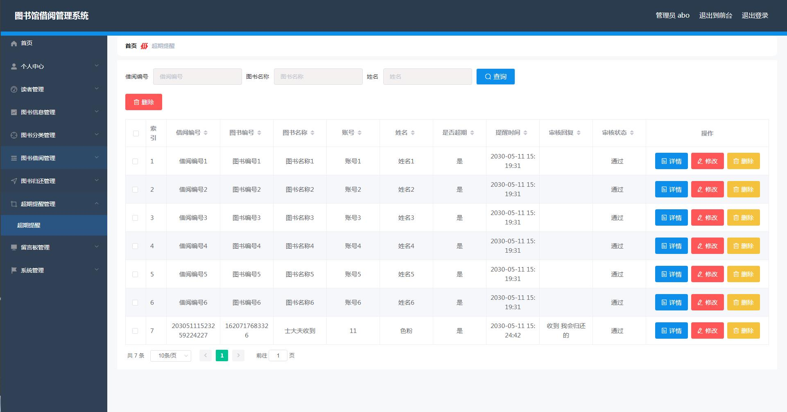
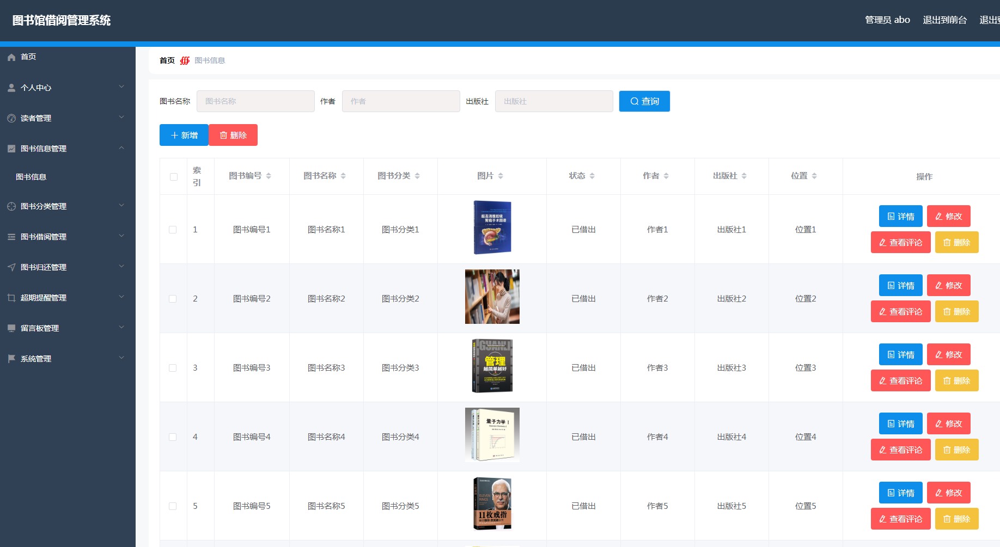
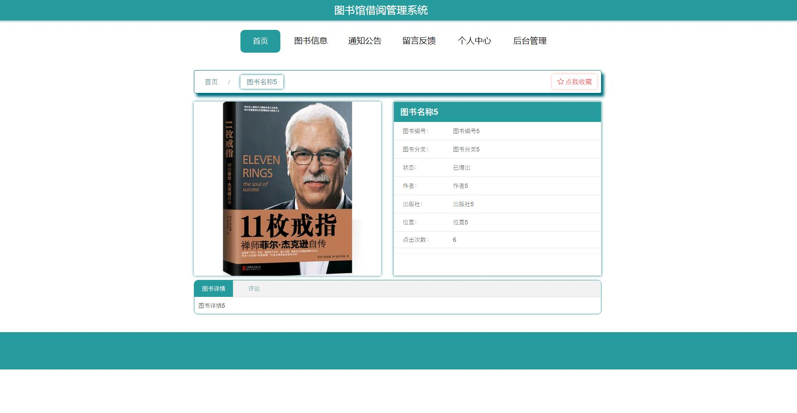

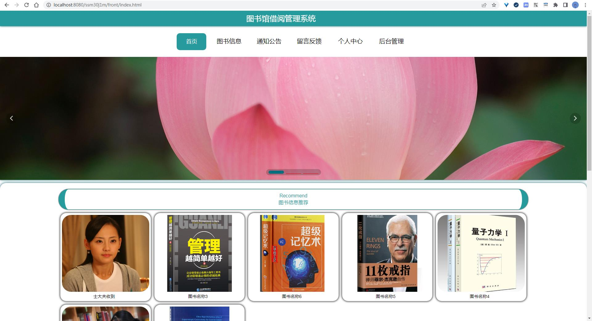

#### 获取源码方式

1.  添加QQ+873015763
2.  个人微信

